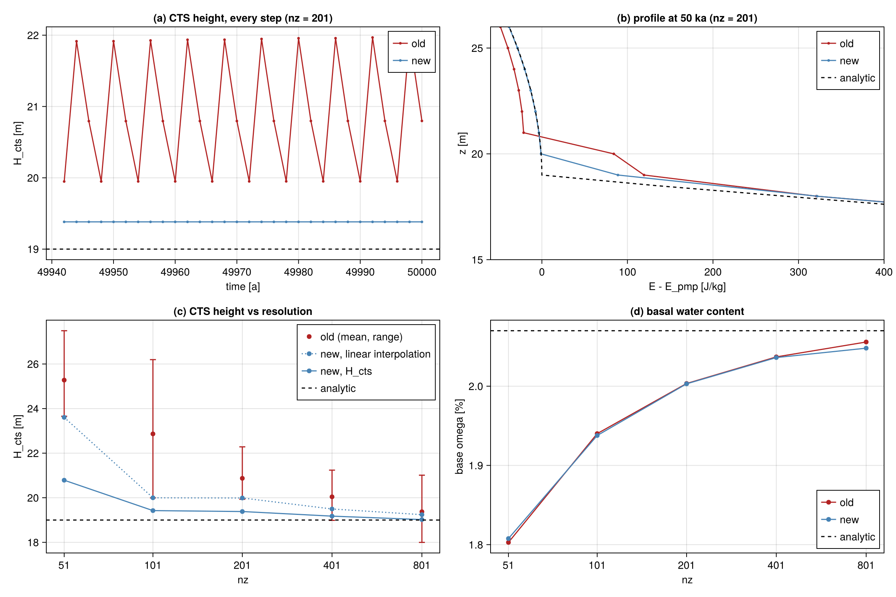

# Sub-grid CTS in the enthalpy column solver

Status: branch `cts-subgrid-30c974` (from dev e5ef9fc0), 2026-10-08. Column tests and
initmip GRL-16 / ANT-32 (1 kyr) and EISMINT EXPA/EXPF done on albedo (clone
`models/yelmo-cts`). Not merged.

Commits:

1. 094a8c35 `therm: enth vertical diffusion with split sensible/latent face flux`
2. 62567bdc `therm: H_cts from temperate-side water-content extrapolation`
3. 62a46423 `tests: kleiner-b checks a steady CTS, tighter tolerance`
4. 6c2b091e `docs/dev: sub-grid CTS write-up`
5. b9896f77 `therm: re-solve the column when a temperate node freezes within the step`
6. 5e0581fa `tests: shelf-freeze column test`

Commit 1 on its own fails in 3D (section 3, "Freezing within a step"); 1 and 5 belong together.

## 1. Problem

`test_enthalpy.x kleiner-b enth 201 1e-4` (Kleiner et al., 2015, Exp B) failed on albedo
with a final CTS height of 21.78 m (analytic 19.0 m, tolerance 2 m), and passed locally with 20.80 m.
The CTS was not steady. It jumped between three nodes every time step (period 3 steps =
6 yr at dt = 2 yr; Fig. 1a). The 500-yr output aliased this into an apparent slow
cycle, so the final snapshot (and PASS/FAIL) depended on the phase. The mean CTS was
about 1.8 m too high at nz = 201. The minmod vertical advection (2961c361) only changed
the phase.

## 2. Cause

The face diffusivity was set per node (cold `Kc` or temperate `K0 = cr*Kc`) and applied to
the full enthalpy difference. At the CTS face the cold diffusivity was used
(`kappa_b = kappa(k_cts+1)`). The enthalpy jump across that face includes the water content
`omega*L` of the temperate node, so cold-ice conduction carried latent heat into the cold
ice. In one step the top temperate node froze, then the next one down did the same, and
then the cold ice warmed back up. The cold side ended up flat at about -21 J/kg below E_pmp instead of
reaching E_pmp with zero gradient, as it does at a melting CTS (Fig. 1b).

## 3. Scheme

The flux on each face is split into a sensible and a latent part:

    F = Kc_f * d(E_s)/dz + K0_f * d(E_l)/dz,   E_s = min(E, E_pmp),   E_l = max(E - E_pmp, 0)

with `Kc_f` the harmonic mean of `kt/(rho*cp)` (whatever the phase) and `K0_f = cr*Kc_f`.
Cold ice conducts its temperature, temperate ice diffuses its water content, and across
the CTS cold ice conducts to the pressure melting point of the temperate node. The flux
is continuous in E, so the CTS settles between nodes.

- Linear system: each node's phase is taken from the start-of-step enthalpy (Dirichlet
  base and surface: from their imposed values). A node then contributes `c*x + d` to a
  face flux (`calc_split_coeffs`; `x = E - enth_ref`): cold `c = Kc`, `d = 0`;
  temperate `c = K0`, `d = (Kc - K0)*(E_pmp - enth_ref)`. Still one tridiagonal solve per step.
- Freezing within a step: see below.
- Picard iteration on the phase was tested and not adopted. One solve already gives a
  consistent phase in 99.8 % of the steps, and at nz = 801 / cr = 1e-5 the iteration cycled
  without changing the result.
- Removed: `calc_enth_diffusivity`, the CTS-face override, the melting-base override
  (`k_cts == 1`; it was also applied to a cold base, because `get_cts_index` returns 1
  there), the floating-base `kappa_a = kappa(1)` override and `kappa_aa(1)` cold override.
  The split covers all of these: a melting base (Dirichlet at E_pmp) gets `Kc*(E_2 - E_pmp)`;
  a floating base at T_shlf below temperate ice gets `Kc*(E_pmp,2 - E_1)` plus the small
  latent part, without the latent leak of the old override.
- A cold column gives the same results as before, bit for bit (the products are ordered
  as before: `wp` is single precision).

**Freezing within a step.** With the phase fixed at the start of the step, a temperate
node has no sensible conduction of its own (its face coefficient is K0). Next to much
colder ice with large `Kc*dt/dz^2` (thin or floating columns on the exponential zeta grid,
`Kc*dt/dz^2` ~ 100 near the base) it then loses heat all step and overshoots far below
its neighbours. Example from GRL-16 (50 m floating column, base at T_shlf): node 2 went
from 311454 to 259397 J/kg, ~25 K below both neighbours. With the integral enthalpy (A2)
the inversion to T_ice then gives NaN: GRL-16 stopped at 50 yr, EISMINT EXPF at 13 kyr.
Fix (commit 5): after the solve, nodes taken as temperate that ended below E_pmp are set
cold and the column is solved again, until no node freezes. Nodes only change from
temperate to cold, so the loop ends (at most nz solves); a node that warms past E_pmp
keeps its cold coefficient for that step, which is the stable direction. The terms that
do not depend on the phase (advection, sources, face diffusivities) are assembled once.
Iterating the phase both ways (Picard) was rejected (it cycles), and so was a relaxation
with implicit Kc everywhere (it leaks the latent heat of temperate ice held at
`omega_max` into the cold ice every step). The `shelf-freeze` column test reproduces the
NaN without commit 5 and passes with it and on dev.

`H_cts` (output only) used linear interpolation of `E - E_pmp` between the top temperate
node and the cold node above. Because the cold side approaches E_pmp with zero gradient,
this puts the CTS up to one layer too high. It now uses the lower of that and the
extrapolation of the temperate water content to zero (nodes `k_cts-1`, `k_cts`, not the
base node). A cold base gives 0. Previously it could give a spurious height there.

## 4. Results



Exp B, cr = 1e-4, dt = 2 yr, 50 kyr; H_cts over the last 1 kyr, every step:

| nz | old H_cts mean [min, max] | new H_cts | new, linear interp. | old base omega | new base omega |
|---|---|---|---|---|---|
| 51  | 25.28 [23.66, 27.49] | 20.79 | 23.61 | 0.0180 | 0.0181 |
| 101 | 22.86 [19.99, 26.20] | 19.42 | 20.00 | 0.0194 | 0.0194 |
| 201 | 20.87 [19.93, 22.28] | 19.38 | 19.99 | 0.0200 | 0.0200 |
| 401 | 20.04 [18.99, 21.24] | 19.18 | 19.50 | 0.0204 | 0.0204 |
| 801 | 19.37 [18.00, 21.01] | 19.02 | 19.24 | 0.0206 | 0.0205 |

Analytic: CTS 19.0 m, base omega 0.0207. The new CTS is constant over the last 1 kyr at
all nz and for cr = 1e-3, 1e-4, 1e-5. Between cr = 1e-4 and 1e-5 the CTS changes by
< 0.01 m; cr = 1e-3 puts it up to 0.6 m higher (nz = 101). Basal water content is unchanged.

Other column tests (`test_enthalpy.x`, default nz = 51 unless noted):

| Test | Before | After |
|---|---|---|
| cold-limit, max abs(T_temp - T_enth) | 1.22e-4 K | 1.22e-4 K (identical) |
| kleiner-a, warm / cold a_b [mm/a] | 2.292 / -1.984 | 2.292 / -1.984 |
| kleiner-a-cap | 2.292 / -1.984 | 2.292 / -1.984 |
| thin-margin | all ok | all ok |
| robin-column, enth-A1 - Robin, Q_geo = 50 | -0.484 K | -0.519 K |
| robin-column, enth-A2 - temp, Q_geo = 50 | 0.417 K | 0.357 K |
| shelf-freeze, nz = 10 / 51 | ok | ok (commit 1 alone: NaN) |

The Robin changes come from the lowest face: the old code used `kappa(2)` there for
any base (the melting-base override), whereas the new code uses the harmonic mean of
nodes 1 and 2, like every other face.

The kleiner-b check is now: CTS within 0.5 m, base omega within 5 %, and an H_cts range
below 5 cm over the last 1 kyr (sampled every step). It passes for nz >= 201. At nz = 101 base omega
is 6 % low.

## 5. 3D checks (albedo, ifx, wp = sp)

initmip present day, 1 kyr, against dev e5ef9fc0 (`models/yelmo-dev`). Final state, means over
ice-covered cells (ts: `yelmo_ts.nc`):

| | GRL-16 dev | GRL-16 new | ANT-32 dev | ANT-32 new |
|---|---|---|---|---|
| V_ice [1e6 km3] | 3.1715 | 3.1735 | 27.968 | 27.971 |
| uxy_s (ts) [m/yr] | 59.34 | 57.85 | 53.58 | 53.06 |
| f_pmp (ts) | 0.4522 | 0.4508 | 0.5591 | 0.5587 |
| bmb (ts) [m/yr] | -0.0844 | -0.0799 | -0.0536 | -0.0534 |
| melt_int (mean) [m/yr] | 0.00171 | 0.00187 | 0.00028 | 0.00031 |
| H_ice rms diff [m] | | 11.4 | | 5.6 |

More englacial water drains to the bed (`melt_int` +9 % / +13 %): water no longer leaks
into the cold ice at the CTS, so more of it reaches `omega_max`. The other changes are small.
Speed: GRL-16 81.8 kyr/h vs 82.5 and 84.4 for two dev runs (no measurable cost from the
re-solve).

EISMINT (serial, 100 kyr), symmetry check of `yelmo_benchmarks` (max Linf/Hmax over the
reflections; EXPF: mean H over the last 20 kyr, gate 2e-2):

| | dev | new |
|---|---|---|
| EXPA (gate 1e-3) | 1.88e-4 | 1.25e-4 |
| EXPF (gate 2e-2) | 1.90e-3 | 1.34e-2 |
| EXPF final-state H D4 error | 2.70e-3 | 2.71e-3 |
| EXPF median H D4 error, 20-100 kyr (5-kyr output) | 1.33e-3 | 1.45e-3 |

With 500-yr output (both runs reproduce the 5-kyr ones exactly): dev never exceeds an H
D4 error of 2.7e-3; the new run exceeds 5e-3 only from 75 to 84 kyr (peak 6.9e-2 at
79.5 kyr), and follows dev before and after (median 20-100 kyr 1.45e-3 vs 1.33e-3). The
episode is a margin retreat. The 8 symmetric images of the margin-ring cell (50,44)
(r = 23 cells) thin, refreeze at the base and deglaciate, but at different times
(76-86 kyr), which sets the D4 error while it lasts. In dev these cells are about 30 m
thicker (365 vs 335 m at 60 kyr) and thin more slowly (~1.2 vs ~3 m/kyr), so they do not
retreat within 100 kyr. The thermal scheme only changes when this threshold event
happens. It is not a new instability: the base and thickness are as symmetric as in dev
outside the episode. The EXPF gate (mean over the last 20 kyr) still passes (1.34e-2 < 2e-2).

## Reproduce

The figure data came from a copy of `tests/test_enthalpy.f90` that writes every step after
49 ka (`kleiner-b enth <nz> 1e-4`), built against dev e5ef9fc0 (old) and this branch (new),
output saved as `<dir>/{old,new}/kb_nz<nz>.nc`:

```bash
julia --project=docs/dev/cts-subgrid/scripts docs/dev/cts-subgrid/scripts/cts_plots.jl <dir> docs/dev/cts-subgrid/figures/cts_kleiner_b.png
```
