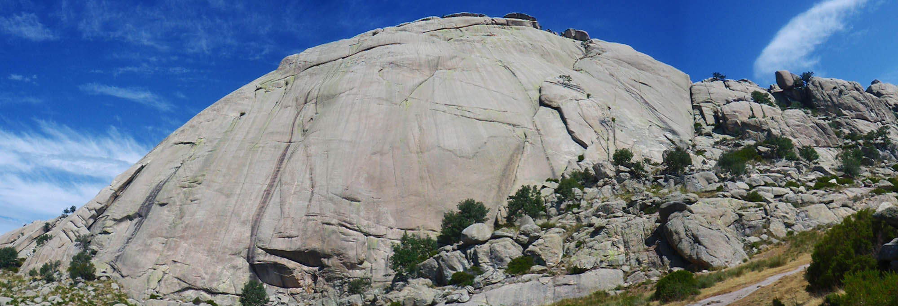

# Yelmo



Welcome to **Yelmo**, an easy to use continental ice sheet model.
**Yelmo** is a 3D ice-sheet-shelf model solving
for the coupled dynamics and thermodynamics of the ice sheet system. Yelmo
can be used for idealized simulations, stand-alone ice sheet simulations
and fully coupled ice-sheet and climate simulations.

**Yelmo** has been designed to operate as a stand-alone model or to be easily plugged in as a module in another program. The key to its flexibility is that no variables are defined globally and parameters are defined according to the domain being modeled. In this way, all variables and calculations are stored in an object that entirely represents the model domain.

The physics and design of **Yelmo** are described in the following article:

> Robinson, A., Alvarez-Solas, J., Montoya, M., Goelzer, H., Greve, R., and Ritz, C.: Description and validation of the ice-sheet model Yelmo (version 1.0), Geosci. Model Dev., 13, 2805–2823, [https://doi.org/10.5194/gmd-13-2805-2020](https://doi.org/10.5194/gmd-13-2805-2020), 2020.

The Yelmo code repository can be found here:
[https://github.com/fesmc/yelmo](https://github.com/fesmc/yelmo)

## General model structure - classes and usage

### yelmo\_class

The Yelmo class defines all data related to a model domain, such as Greenland or Antarctica. As seen below in the yelmo\_class definition, the 'class' is simply a user-defined Fortran type that contains additional types representing various parameters, variables or sets of module variables.

```fortran
    type yelmo_class
        type(yelmo_param_class) :: par      ! General domain parameters
        type(grid_class)        :: grd      ! Grid definition (fesm-utils/coords)
        type(ytime_class)       :: time     ! Timestep and timing variables
        type(ytime_class)       :: time_amc ! Timestep and timing variables
        type(ytopo_class)       :: tpo      ! Topography variables
        type(ydyn_class)        :: dyn      ! Dynamics variables
        type(ymat_class)        :: mat      ! Material variables
        type(ytrc_class)        :: trc      ! Passive-tracer subsystem (euler/tracer/elsa backends)
        type(ytherm_class)      :: thrm     ! Thermodynamics variables
        type(hydro_class)       :: hyd      ! Basal hydrology (fasthydrology)
        type(ybound_class)      :: bnd      ! Boundary variables to drive model
        type(ydata_class)       :: dta      ! Data variables for comparison
        type(yregions_class)    :: reg      ! Regionally aggregated variables for whole domain
        type(yregions_class), allocatable :: regs(:)  ! Regionally aggregated variables for sub-regions
        type(yelmo_io_tables)   :: io       ! IO variable tables
        character(len=512)      :: outfldr  ! Output folder for files written internally by yelmo (regions, metrics)
    end type

```

Likewise the module variables are defined in a similar way, e.g. ytopo\_class that defines variables and parameters associated with the topography:

```fortran
    type ytopo_class

        type(ytopo_param_class) :: par        ! Parameters
        type(ytopo_state_class) :: now        ! Variables
        type(ytopo_pc_class)    :: pc         ! Predictor-corrector variables
        type(rk4_class)         :: rk4

    end type
```

Components such as ytopo\_class include the parameters relevant to topography calculations (`par`), as well as all variables that define the state of the domain being modeled (`now`).

### Example model domain initialization

The below code snippet shows an example of how to initialize an instance of Yelmo
inside of a program, run the model forward in time and then terminate the instance.

```fortran
    ! === Initialize ice sheet model =====
    
    ! Initialize Yelmo objects (multiple yelmo objects can be initialized if needed)
    ! In this case `yelmo1` is the Yelmo object to initialize and `path_par` is the
    ! path to the parameter file to load for the configuration information. This
    ! command will also initialize the domain grid and load initial topographic
    ! variables.

    call yelmo_init(yelmo1,filename=path_par,grid_def="file",time=time_init)

    ! Optional arguments: outfldr, the folder for the files Yelmo writes itself
    ! (region time series, metrics), and cnst, a phys_const_class with the
    ! physical constants, for a driver that shares one set of constants
    ! between the components of a coupled model.

    ! === Load initial boundary conditions for current time and yelmo state =====
    ! These variables can be loaded from a file, or passed from another
    ! component being simulated. Yelmo does not care about the source.
    ! z_bed (and z_bed_sd), the masks and the reference fields are set by
    ! yelmo_init; the forcing below must be set by the driver.

    yelmo1%bnd%z_sl     = [2D array]    ! [m] Sea level
    yelmo1%bnd%H_sed    = [2D array]    ! [m] Sediment thickness
    yelmo1%bnd%smb      = [2D array]    ! [m/a ice equiv.] Surface mass balance
    yelmo1%bnd%T_srf    = [2D array]    ! [K] Surface temperature
    yelmo1%bnd%bmb_shlf = [2D array]    ! [m/a ice equiv.] Sub-shelf basal mass balance
    yelmo1%bnd%fmb_shlf = [2D array]    ! [m/a ice equiv.] Frontal mass balance (ytopo.fmb_method=0,2)
    yelmo1%bnd%Q_geo    = [2D array]    ! [mW/m2] Geothermal heat flux

    ! Depending on the methods used: T_shlf, tf_shlf and Qd (ocean
    ! temperature, thermal forcing and subglacial discharge for frontal melt
    ! and ismip7 calving), enh_srf (surface enhancement factor, "*-tracer" enh_method).

    ! Print summary of initial boundary conditions
    call yelmo_print_bound(yelmo1%bnd)


    ! Next, initialize the state variables (dyn,therm,mat)
    ! (in this case, initialize temps with robin method)

    call yelmo_init_state(yelmo1,time=time_init,thrm_method="robin")

    ! Run yelmo for eg 100.0 years with constant boundary conditions and fixed topography
    ! to equilibrate thermodynamics and dynamics
    ! (impose a constant, small dt=1yr to reduce possibility for instabilities)

    call yelmo_update_equil(yelmo1,time,time_tot=100.0_wp,topo_fixed=.TRUE.,dt=1.0_wp)

    ! == YELMO INITIALIZATION COMPLETE ==
    ! Note: the above routines `yelmo_init_state` and `yelmo_update_equil`
    ! are optional, if the user prefers another way to initialize the state variables.

    ! == Start time looping and run the model ==

    ! Advance timesteps
    do n = 1, ntot

        ! Get current time
        time = time_init + n*dt

        ! Update the Yelmo ice sheet
        call yelmo_update(yelmo1,time)

        ! Here you may be updating `yelmo1%bnd` variables to drive the model transiently.

    end do

    ! == Finalize Yelmo instance ==
    call yelmo_end(yelmo1,time=time)

```

A coupled program that owns the domain definition (grid, masks, topography) can
pass these to `yelmo_init` instead of having Yelmo read them from files. Each
optional field replaces the matching file read; the processing that follows is
the same:

```fortran
    type(ytopo_input_class) :: topo_pd, topo_init   ! topo_pd: H_ice, z_bed, z_srf [, z_bed_sd]; topo_init: H_ice, z_bed [, z_bed_sd]

    call yelmo_init_grid(yelmo1%grd,grid)           ! grid: a coords grid_class
    call yelmo_init(yelmo1,filename=path_par,grid_def="none",time=time_init, &
                    domain=domain,grid_name=grid%name, &
                    regions=regions,basins=basins,mask_ice=mask_ice, &
                    topo_pd=topo_pd,topo_init=topo_init)
```

That's it!

See [Getting started](getting-started.md) to see how to get the code,
compile a test program and run simulations.
